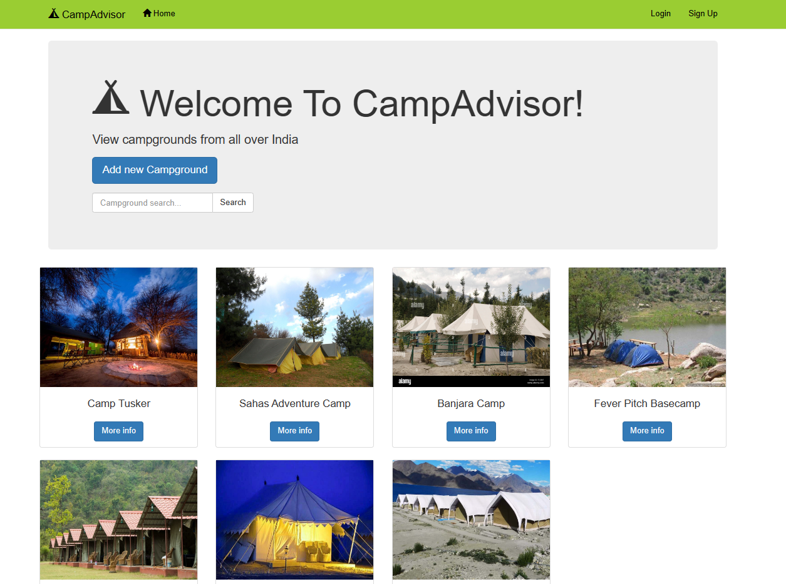
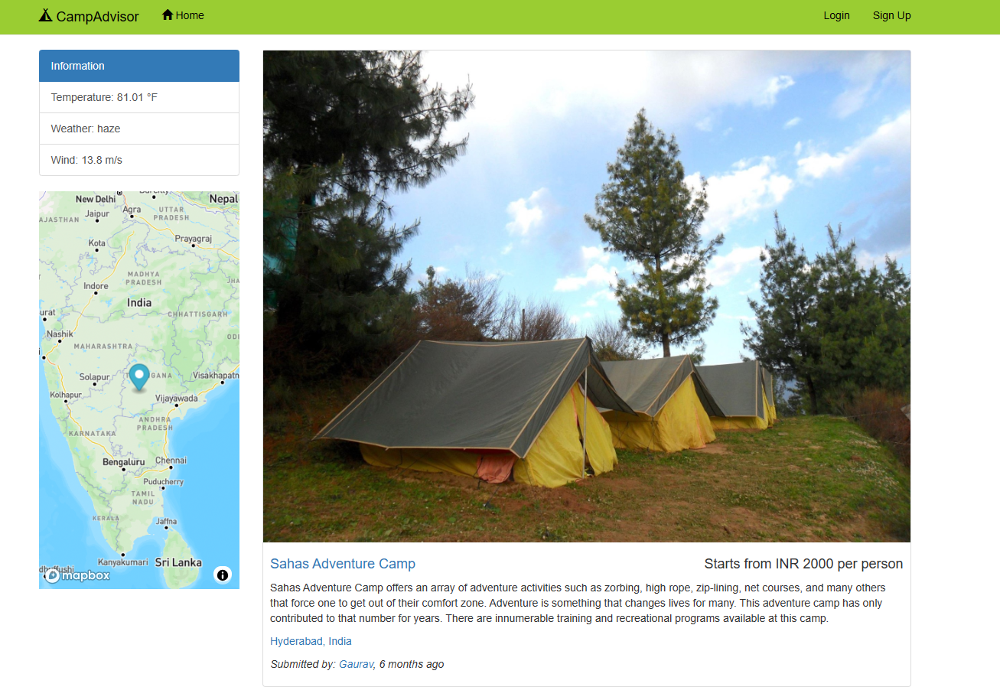

# CampAdvisor Project

### Description

Node.js web application with RESTful routing.

### Main Function/Feature

- Authentication
- Database Management
- Deploying
- Fuzzy Search
- Landing Page
- Image Upload
- Pagination
- Location on Map
- Real Time Weather Information

### Language and Tools

- Cloudinary
- Render
- HTML/CSS/Javascript
- MongoDB
- Node.js

### Website Images

#### Landing Page

#### Campground Information

